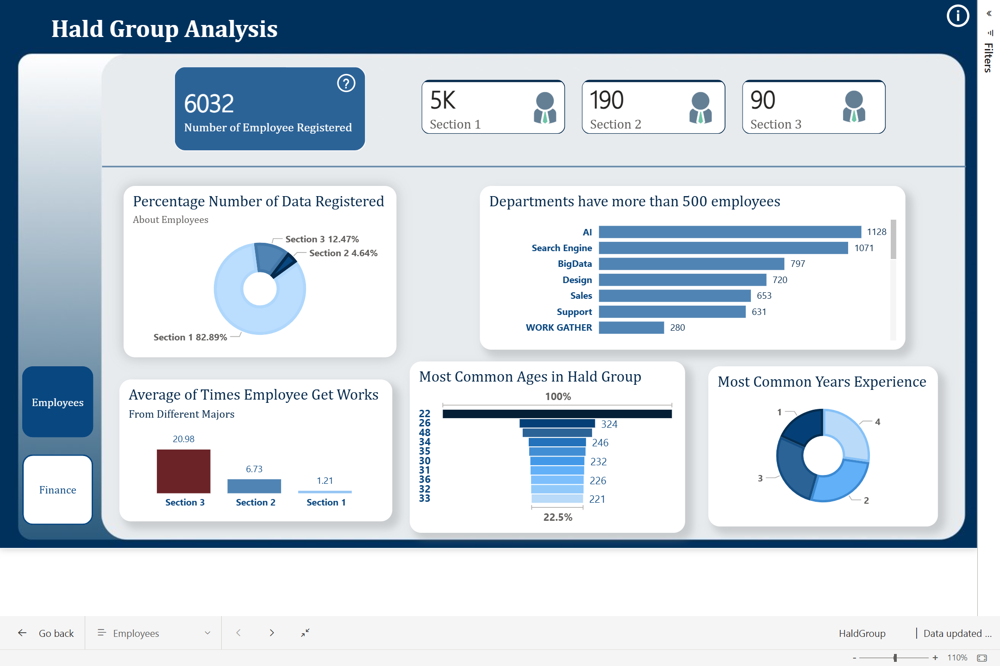

# Project: Basic Data Pipeline & Visual Analysis 
Basic data pipeline that help businesses to save data and survive from wrong decisions into market.
 

---
 

## Details 
The project developed using python for fake scenario. The project based on ETL Process to extract data from three basic sources: 2 SQL databases, and CSV file, each one representing section. Transform process focused on cleaning the data and transforming it to be suitable for final warehouse. Load final transformed data into SQL database.
 

--- 
 

## Scenario
> Warning: The scenario is fake, created just for practice.
 
Hald Group is new company into technology market that has several obstacles during 2025, specifically on HR. Company has 3 sections, and the last third section is the newest one. Each section has its own database, the problem is each section has different structure of database, the first section has more detailed structure,The second section and third  have no efficient employee who deal with data well. 
**Task:** Create data pipeline for all datasets to fit the base database of Hald Group, then visualize it by dashboard using Power BI. 
**Message:** The third section did small problem, they add a birthdate instead of age, and their database changed the the dates to be all employees older than their real ages by 50 years, if find age less than 18, you must now it’s real age is 22.

## Results of Dashboard
- Some sections may combine their trainers data with employees data, they must be into separated tables.  
> How found that? If you see data you’ll find many employees with 22 ages, and $0 salary. 
- The third section has many problems with their human resource management (HR) that single person may do many and variant tasks, which lead to decreases the quality and increase injuries and stress. Also the third section have many departments that they can’t control all of them with few number of employees, also they have the least average of salaries between other sections and no bonuses (not sure if section not concerned to record bonuses or they didn’t get that), even the company eager to give their employees more than that and bonuses. 
> How found that? The third section recorded the same employee ID with different majors. 
- The third section contains many employees who nearly graduated, which lead to have no enough years experience.  
- The second section didn’t record their departments, not sure if it isn't has departments or they didn’t concern to record them.
- The first section has many seniors who may lead other sections to be more qualified.  
> How found it? The number of employees into section 1 and their salaries and years experience. 
- The company (Hald Group) focused into 2025 on AI and BigData, based on their high salaries and bonuses and number of employees into these departments. Also it focused on increasing their sales and designs. 
- In general, The company follows the natural salary scale system, more experience more money you get.  
- The company focuses on new generation (how under 30 age) employees, may for many reasons that one of them is it hope that new generation is more learnable for technology tools and techniques.Also more information absorbing capable.  
   

**Images of Dashboard**

 

 

 

 

  

---

 

## Tools Used
- 'Python' -> Google Colab.
- 'SQL' -> SQLLite -> DB Browser for SQLLite.
- 'Power BI'.
- 'Excel' -> to modify data, gather how third section employees repeated into the dataset.

 

---
 

## Project Files Uploaded
- Data pipeline process (ETL) into '.ipynb' file.
- Power BI dashboard into '.pbix' file.
- SQL databases into '.db' files.

 

---
 

## Data Resources 

- Employees database sample - [GitHub](https://github.com/profolsen/employees/blob/master/sql/employees.sql)
- Fake data inserted into second database by Gemini.
- CSV file - [Kaggle](https://www.kaggle.com/datasets/iqmansingh/company-employee-dataset)

